# Domain Model

_Derived from the feature specs in `docs/specs/`. Do not edit the generated
region by hand — run `/domain-diagram` after changing a spec. Text outside the
markers is preserved._

<!-- BEGIN GENERATED: domain-diagram -->

## Entity Relationship Diagram

```mermaid
erDiagram
    %% ============================================================
    %% Accounts - spec 001-002
    %% ============================================================
    User {
        UUID id PK "generated, immutable"
        string email UK "required, max 256, unique case-insensitively"
        string displayName "required, 1-50 chars after trimming"
        string passwordHash "salted one-way hash, write-only"
        datetime createdAt "generated, immutable, UTC"
        integer failedLoginAttempts "default 0, reset on successful login"
        datetime lockoutEndsAt "nullable, UTC - future value means locked"
    }

    %% ============================================================
    %% Personal records - spec 003-004
    %% Each carries the OwnedRecord shape and nothing more. Their own
    %% attributes belong to stories 009, 010, 022, 023, 024, 027-029.
    %% ============================================================
    Rating {
        UUID id PK "generated, immutable"
        UUID ownerUserId FK "required, immutable, points at User.id"
        datetime createdAt "generated, immutable, UTC"
        integer filmTmdbId FK "points at Film.tmdbId - name not spec-fixed"
    }

    WatchlistEntry {
        UUID id PK "generated, immutable"
        UUID ownerUserId FK "required, immutable, points at User.id"
        datetime createdAt "generated, immutable, UTC"
        integer filmTmdbId FK "points at Film.tmdbId - name not spec-fixed"
    }

    WatchHistoryEntry {
        UUID id PK "generated, immutable"
        UUID ownerUserId FK "required, immutable, points at User.id"
        datetime createdAt "generated, immutable, UTC"
        integer filmTmdbId FK "points at Film.tmdbId - name not spec-fixed"
    }

    DismissedRecommendation {
        UUID id PK "generated, immutable"
        UUID ownerUserId FK "required, immutable, points at User.id"
        datetime createdAt "generated, immutable, UTC"
        integer filmTmdbId FK "points at Film.tmdbId - name not spec-fixed"
    }

    TasteProfile {
        UUID id PK "generated, immutable"
        UUID ownerUserId FK "required, immutable, points at User.id"
        datetime createdAt "generated, immutable, UTC"
    }

    MovieNightVote {
        UUID id PK "generated, immutable"
        UUID ownerUserId FK "required, immutable, points at User.id"
        datetime createdAt "generated, immutable, UTC"
    }

    %% ============================================================
    %% Catalogue - minimal shape from 003-004, completed by 005-008
    %% Film is the one entity deliberately outside the ownership rule.
    %% ============================================================
    Film {
        integer tmdbId PK "the only identity a film has, anywhere"
        string title "required, max 300"
        integer releaseYear "nullable - widened from 003-004 required"
        integer runtimeMin "nullable, greater than 0"
        string_array genres "names never ids, 0..n - via GenreMap"
        string posterPath "nullable, TMDB-relative path, never a full URL"
        string synopsis "nullable"
        string originalTitle "nullable, max 300"
        string backdropPath "nullable, relative path as posterPath"
        string originalLanguage "nullable, ISO 639-1"
        decimal tmdbVoteAverage "nullable, 0-10 - catalog rating, not a Rating"
        integer tmdbVoteCount "nullable, at least 0"
        enum detailLevel "summary or full, required - monotonic"
        enum source "seed, search, detail, recommendation - diagnostics"
        datetime firstSeenAt "generated, immutable, UTC"
        datetime fetchedAt "nullable, UTC - last successful catalog fetch"
        enum lastFetchOutcome "nullable - one of the failure kinds in 3.3"
    }

    GenreMap {
        integer tmdbId PK "TMDB genre id"
        string name "required, max 100"
        datetime fetchedAt "required, UTC"
    }

    %% ============================================================
    %% Not persisted - process state and checked-in fixture
    %% ============================================================
    CatalogStatus {
        enum configuration "unconfigured, unverified, valid, rejected"
        integer consecutiveFailures "at least 0, reset to 0 by any success"
        datetime suppressCallsUntil "nullable, UTC - circuit breaker window"
        datetime retryNotBefore "nullable, UTC - Retry-After window"
        CatalogFailure lastFailure "nullable value object"
    }

    DemoAccountDefinition {
        string email "required, valid, unique in fixture - idempotence key"
        string displayName "required, 1-50"
        string password "required, min 8 - plaintext in repo by design"
        string tasteLabel "required, human-readable"
        string_array preferredGenres "1..n"
        string_array preferredEras "0..n"
        seed_array ratings "1..n - tmdbId, loved/liked/meh, relative age"
        seed_array history "0..n - tmdbId, relative age"
        seed_array watchlist "0..n - tmdbId, relative age"
    }

    %% ---- Ownership: every personal record has exactly one owner ----
    User ||--o{ Rating : "rates"
    User ||--o{ WatchlistEntry : "saves to watchlist"
    User ||--o{ WatchHistoryEntry : "has watched"
    User ||--o{ DismissedRecommendation : "dismisses"
    User ||--o{ TasteProfile : "states preferences in"
    User ||--o{ MovieNightVote : "casts"

    %% ---- Film is shared and ownerless; the reference is the private fact ----
    Film ||--o{ Rating : "is rated in"
    Film ||--o{ WatchlistEntry : "appears on"
    Film ||--o{ WatchHistoryEntry : "is logged in"
    Film ||--o{ DismissedRecommendation : "is dismissed in"

    %% ---- Seeding ----
    DemoAccountDefinition ||--o| User : "seeds"
```

## Entities

| Entity | Description | Source Spec |
| ------ | ----------- | ----------- |
| User | A person with an account. The root of all ownership; every personal record points back at `User.id`. | [001-002](specs/001-002-accounts-and-sessions.md) §5.1 |
| Rating | A user's opinion of a film. Carries the `OwnedRecord` shape; its own attributes are owned by story 009. | [003-004](specs/003-004-private-data-and-demo-accounts.md) §5.1 (shape only) |
| WatchlistEntry | A film a user intends to watch. Shape only; story 022 defines it. | [003-004](specs/003-004-private-data-and-demo-accounts.md) §5.1 (shape only) |
| WatchHistoryEntry | A film a user has watched. Shape only; story 024 defines it. | [003-004](specs/003-004-private-data-and-demo-accounts.md) §5.1 (shape only) |
| DismissedRecommendation | A recommendation a user has waved away. Shape only; no story claims it yet. | [003-004](specs/003-004-private-data-and-demo-accounts.md) §5.1 (shape only) |
| TasteProfile | A user's stated genre and era preferences. Shape only; stories 010 and 023 define it. | [003-004](specs/003-004-private-data-and-demo-accounts.md) §5.1 (shape only) |
| MovieNightVote | A user's yes/no on a shortlisted film. Shape only; stories 027–029 define it. | [003-004](specs/003-004-private-data-and-demo-accounts.md) §5.1 (shape only) |
| Film | Shared, ownerless catalogue data — the local copy of a TMDB film. Minimal shape pinned by 003-004, completed by 005-008 additively on the same key. | [003-004](specs/003-004-private-data-and-demo-accounts.md) §5.1 → [005-006-007-008](specs/005-006-007-008-live-movie-catalog.md) §5.1 |
| GenreMap | The catalog's genre id-to-name mapping, refreshed at most once per run with a checked-in fallback. | [005-006-007-008](specs/005-006-007-008-live-movie-catalog.md) §5.1 |
| CatalogStatus | **Not persisted** — in-memory state of the TMDB connection: configuration verdict, failure count, breaker and retry windows. A restart legitimately resets it. | [005-006-007-008](specs/005-006-007-008-live-movie-catalog.md) §5.1 |
| DemoAccountDefinition | **Not persisted** — the checked-in fixture describing a demo account. Input to seeding, not its output. | [003-004](specs/003-004-private-data-and-demo-accounts.md) §5.1 |

`Film.releaseYear` is the one attribute two specs type differently: 003-004 §5.1 made it
`integer` required, 005-008 §5.1 widened it to nullable because TMDB ships films with no
release date (FR-015). The later, explicitly-stated widening is what the diagram shows.

## Value Objects

| Value Object | Owned By | Source Spec |
| ------------ | -------- | ----------- |
| EmailAddress | `User` — flattened into `User.email`. Normalized by trimming and lowercasing; equality is equality of the normalized form. | [001-002](specs/001-002-accounts-and-sessions.md) §5.3 |
| TmdbFilmId | `Film` — flattened into `Film.tmdbId` as its identity. Every film-referencing record carries it as a foreign key rather than embedding a second copy. | [003-004](specs/003-004-private-data-and-demo-accounts.md) §5.3, restated in [005-006-007-008](specs/005-006-007-008-live-movie-catalog.md) §5.3 |
| CatalogFailure | `CatalogStatus.lastFailure` — kind, occurredAt, retryAfter, correlationId. Carries no response body, no URL and no credential. | [005-006-007-008](specs/005-006-007-008-live-movie-catalog.md) §5.3 |
| FilmSearchResult | — transient, one request only; never persisted (see Deliberate Non-Entities). | [005-006-007-008](specs/005-006-007-008-live-movie-catalog.md) §5.3 |
| SearchQuery | — transient. Trimmed text (2–200 chars) plus page (1–500); trimmed once at construction. | [005-006-007-008](specs/005-006-007-008-live-movie-catalog.md) §5.3 |
| ImageReference | — render-time only, resolved from `Film.posterPath` / `Film.backdropPath` against the configured image base. | [005-006-007-008](specs/005-006-007-008-live-movie-catalog.md) §5.3 |

## Structural Invariants

_Cross-entity rules that the diagram cannot express — uniqueness across columns,
conditional nullability, ordering, cascade behaviour._

- **Unique normalized email** — no two `User` rows may share a trimmed, lowercased email.
  Enforced at the store, not only in validation, so two concurrent sign-ups yield one
  account. 001-002 §5.4, EC-6; ADR-0001 makes this a unique index on `NormalizedEmail`.
- **No ownerless personal record** — persisting any `OwnedRecord` without an
  `ownerUserId` referencing an existing `User` is a failure, not a row with a null column.
  001-002 §5.4 (write path) → 003-004 §5.4 (store-level constraint).
- **Ownership is immutable** — `ownerUserId` is set at creation and never changes. No
  transfer, no re-parenting, no account merge. 003-004 §5.4.
- **Read scope equals ownership** — a read of a record not owned by the acting user
  returns nothing, indistinguishable from the record not existing. Enforced at the
  data-access layer, not per query. 003-004 §5.4, NFR-002.
- **`Film` is ownerless and exempt from the ownership chokepoint** — the one entity
  deliberately outside 003-004's rule. A filter applied indiscriminately would make every
  film invisible. 005-008 §5.4, §9.1.
- **A film has one identity: `tmdbId`** — seeded, searched and recommended records for the
  same film are one record; the application mints no film identifiers. Uniqueness is
  enforced by the store, not an in-memory check. 003-004 §5.4, 005-008 §5.4, EC-20.
- **No orphan personal record** — a `Rating`, `WatchlistEntry`, `WatchHistoryEntry` or
  `DismissedRecommendation` requires its `Film` to exist locally; the film is written
  first, in the same transaction. 005-008 FR-026, §5.4, EC-22.
- **`detailLevel` is monotonic** — `summary → full` is the only permitted transition. A
  save from a summary source may add fields and may not null out fields a full record
  supplied. 005-008 §5.4, EC-21.
- **Genres are stored as names, never ids** — `GenreMap` is a lookup resolved at save
  time, not a foreign key `Film` holds, so a genre rename cannot orphan a film. An
  unresolvable genre is omitted and filled on the next refresh. 005-008 §5.2, §5.4, EC-26.
- **A failed refresh leaves the record alone** — previous values stand and
  `lastFetchOutcome` records why. Staleness never invalidates or suppresses a record.
  005-008 §5.4.
- **Lockout is derived, not a stored flag** — an account is locked if and only if
  `lockoutEndsAt` is in the future; nothing actively unlocks it. 001-002 §5.4.
- **Creation data is immutable** — `id` and `createdAt` never change after creation.
  001-002 §5.4, 003-004 §5.1.
- **Secrets are write-only** — `passwordHash` is never reversed, returned, logged or
  rendered (001-002 §5.4); the TMDB credential is header-only and never stored (005-008
  §5.4). Same rule, two secrets.
- **Seed idempotence is keyed on normalized email** — a demo account exists if a `User`
  with that normalized email exists, using 001-002's normalization. If it exists, seeding
  touches nothing. 003-004 §5.4, EC-8.
- **Seeding is all-or-nothing** — every demo account and all its data commit together or
  none does. 003-004 §5.4, NFR-004, EC-9.
- **Seeded time is relative** — fixtures express ages ("3 days before seeding"), never
  calendar dates, so seeded history does not age with the repository. 003-004 FR-022.
- **`CatalogStatus` is out of the store** — process state only, so the ownership
  chokepoint has no reason to reach it and a corrupted status cannot outlive a restart.
  005-008 §5.1, §5.2, EC-24.

## Deliberate Non-Entities

| Concept | Why not an entity | Source Spec |
| ------- | ----------------- | ----------- |
| Session | Authentication is a signed, encrypted cookie held by the browser, with no server-side record. Consequences: logging out in one browser does not end a sign-in in another; a demo reset cannot invalidate live cookies; movie night cannot ask who is online. | [001-002](specs/001-002-accounts-and-sessions.md) §5.2, restated [003-004](specs/003-004-private-data-and-demo-accounts.md) §5.2, EC-10 |
| OwnedRecord | A shared shape carried by every personal entity, not a table of its own. | [003-004](specs/003-004-private-data-and-demo-accounts.md) §5.1 |
| Search result | A `FilmSearchResult` exists for one request and is discarded. Searching persists nothing — interaction is what persists a film. | [005-006-007-008](specs/005-006-007-008-live-movie-catalog.md) §5.2, FR-019, §10 Q2 |
| Film-to-genre link | `GenreMap` is a lookup consulted at save time, not a join table or a foreign key `Film` holds. | [005-006-007-008](specs/005-006-007-008-live-movie-catalog.md) §5.2 |
| Role / permission / group | The only distinction in the system is signed in vs. not. Demo accounts hold no privilege; nothing branches on whether a `User` was seeded. | [001-002](specs/001-002-accounts-and-sessions.md) §1.3, [003-004](specs/003-004-private-data-and-demo-accounts.md) §1.3, §5.4 |

## Open Issues

_Conflicts between specs, forward-declared entities, and entities named in
requirements but never modelled. Empty is the goal._

- **Six personal entities are forward-declared only.** `Rating`, `WatchlistEntry`,
  `WatchHistoryEntry`, `TasteProfile`, `DismissedRecommendation` and `MovieNightVote` are
  named in 001-002 §5.2, 003-004 §5.1/§5.2 and 005-008 §5.2, but no spec defines their own
  attributes — only the `OwnedRecord` shape they inherit. 003-004 §5.1 defers them to
  stories 009, 010, 022, 023 and 024 explicitly; the diagram shows exactly what is stated
  and nothing more. `DismissedRecommendation` is the odd one out: it appears in both
  003-004's applies-to list and 005-008 §5.2, but no story is named as its owner.
- **The film-reference column has no spec-given name.** 005-008 §5.2 states that `Rating`,
  `WatchlistEntry`, `WatchHistoryEntry` and `DismissedRecommendation` reference `Film`
  "always by `tmdbId`", but no spec names the attribute. `filmTmdbId` in the diagram is a
  placeholder, flagged in its comment; the owning story should fix the name.
- **`TasteProfile` cardinality is unstated.** The diagram draws `User ||--o{ TasteProfile`
  because 003-004 §5.2 says a User owns many OwnedRecords "of each kind", with no
  exception. A taste profile is almost certainly one-per-user — stories 010 and 023 should
  settle it, and this line should tighten to `||--||` if so.
- **Movie night has no modelled structure.** 003-004 FR-008 and SC-008 describe a
  "movie-night session" with participants, a blended shortlist and votes on shortlisted
  films, and `MovieNightVote` is listed as an OwnedRecord — but no spec models the session,
  the shortlist, or the vote's link to a `Film`. Stories 027–029 own this; until then
  `MovieNightVote` floats with only its owner.
- **`Film.releaseYear` is typed differently by two specs.** 003-004 §5.1 requires it;
  005-008 §5.1 makes it nullable and says so explicitly ("widened from 003-004"). Recorded
  as reconciled, not as a live conflict — but a reader of 003-004 alone would re-narrow it.

<!-- END GENERATED: domain-diagram -->
